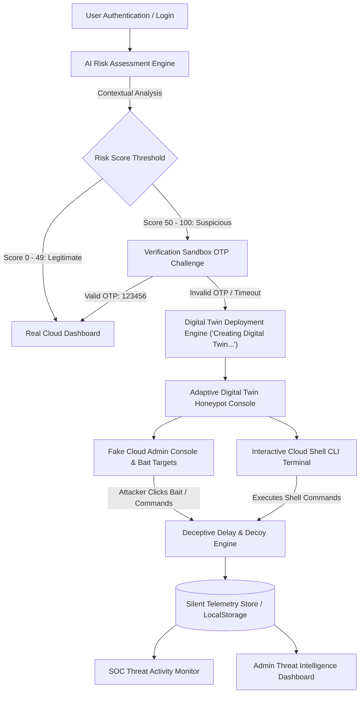
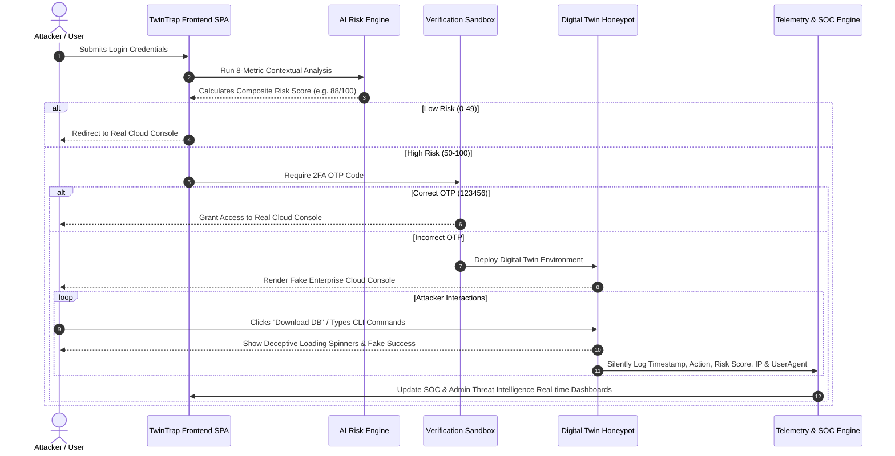

# TwinTrap – Adaptive Digital Twin Honeypot for Credential-Based Attack Detection


**TwinTrap** is an enterprise-grade cybersecurity SaaS prototype implementing an **Adaptive Digital Twin Honeypot**. It is specifically engineered to detect, isolate, and neutralize credential-based attacks, brute-force attempts, and unauthorized privilege escalation in cloud environments.

When a user attempts to log in, TwinTrap runs an **AI Risk Assessment Engine** evaluating contextual signals. Legitimate users with low risk scores are directed to the **Real Cloud Dashboard**. Suspicious sessions or failed OTP verifications are seamlessly rerouted into a believable **Adaptive Digital Twin Honeypot**, isolating attacker actions while recording detailed forensic telemetry into an **Admin Threat Intelligence Dashboard**.

---

## 📐 Architecture Diagram



### Authentication & Routing Sequence



---

## 📂 Folder Structure

```
TwinTrap/
│
├── index.html                # Main SPA interface containing all 6 core view containers & modals
├── css/
│   └── styles.css            # Enterprise SOC design system (Glassmorphism, dark themes, CSS tokens, animations)
├── js/
│   └── app.js                # Core JS application engine (State router, AI Risk Engine, Honeypot traps, Telemetry)
├── README.md                 # Complete documentation & technical guide
└── implementation_plan.md    # Architecture and design plan document
```

---

## 🚀 Installation & Local Execution Guide

TwinTrap is built as a zero-backend, high-performance web application utilizing **HTML5, Vanilla CSS3, JavaScript (ES6+), and LocalStorage**. No database installation or complex build tools are required.

### Option 1: Direct File Launch
Simply open `index.html` in any modern web browser (Google Chrome, Mozilla Firefox, Microsoft Edge, Brave, Safari).

### Option 2: Local HTTP Server (Recommended)

#### Using Python (Built-in)
```bash
# Navigate to the project root directory
cd TwinTrap

# Start Python HTTP Server on port 8080
python -m http.server 8080
```
Open your browser and navigate to: **`http://localhost:8080/index.html`**

#### Using Node.js `serve` / `http-server`
```bash
# Install serve globally if needed
npm install -g serve

# Run server in current directory
serve .
```
Navigate to the provided localhost URL (e.g., `http://localhost:3000`).

---

## 💾 Database Schema (LocalStorage Telemetry Store)

All session state, risk evaluation results, attacker actions, and audit logs are managed client-side using `localStorage` under the key **`twintrap_logs`**.

### Telemetry Record Schema

```json
{
  "id": "LOG-89101",
  "timestamp": "8/1/2026, 11:30:45 AM",
  "action": "Download Production Customer Database",
  "category": "Digital Twin Trap Triggered",
  "riskScore": 98,
  "isHoneypot": true,
  "ip": "185.220.101.45",
  "location": "Frankfurt, DE (Tor Exit Node)",
  "userAgent": "Mozilla/5.0 (X11; Linux x86_64; rv:109.0)",
  "sessionId": "SESS-9821"
}
```

### Data Field Definitions

| Field | Type | Description |
| :--- | :--- | :--- |
| `id` | `String` | Unique telemetry log identifier (e.g., `LOG-XXXXX`, `TRAP-XXXXX`, `CLI-XXXXX`) |
| `timestamp` | `String` | Localized date and time string of the event occurrence |
| `action` | `String` | Description of the action executed by the user or attacker |
| `category` | `String` | Event category (`Honeypot Trap Hit`, `Interactive Attacker Terminal`, `Authentication Failure`, `Real Dashboard Access`) |
| `riskScore` | `Number` | Calculated risk score between `0` (Safe) and `100` (Critical Threat) |
| `isHoneypot` | `Boolean` | `true` if event occurred within the Digital Twin Honeypot, `false` otherwise |
| `ip` | `String` | Client IP address (simulated or real client address) |
| `location` | `String` | Geolocation estimate based on IP reputation |
| `userAgent` | `String` | Client browser User-Agent string |
| `sessionId` | `String` | Unique session identifier linked to the active browser session |

---

## 🔌 Internal API & Module Reference (`js/app.js`)

`js/app.js` exposes modular functions managing application flow, risk calculations, honeypot traps, and telemetry storage:

### 1. View Navigation & Routing
- `switchView(viewId)`
  - **Parameters**: `viewId` (`String`) – Target view ID (`login-view`, `risk-view`, `sandbox-view`, `real-dashboard-view`, `honeypot-view`, `threat-monitor-view`, `admin-view`).
  - **Behavior**: Activates target view container, updates top navbar link states, triggers background canvas transitions, and refreshes Chart.js chart instances.

### 2. Risk Assessment Engine
- `triggerLoginFlow(forceRiskScore)`
  - **Parameters**: `forceRiskScore` (`Number`) – Optional score override for testing presets.
  - **Behavior**: Displays multi-step scan modal overlay (`Authenticating...` → `Connecting...` → `Scanning...` → `Initializing...`) before invoking `runRiskAssessment()`.
- `runRiskAssessment(forcedScore)`
  - **Behavior**: Calculates values for 8 risk metrics, renders Chart.js speedometer gauge with needle animation, and routes user to either Real Dashboard (score <50) or Sandbox (score >=50).

### 3. Verification Sandbox
- `verifyOtpCode()`
  - **Behavior**: Checks 6-digit OTP input. If `123456`, logs success and redirects to Real Cloud Dashboard. If incorrect, logs failure event, displays matrix overlay *"Creating Digital Twin Environment..."*, and redirects to Honeypot.

### 4. Honeypot & Deception Engine
- `triggerHoneypotDecoy(actionName)`
  - **Parameters**: `actionName` (`String`) – Name of the bait button clicked.
  - **Behavior**: Simulates realistic multi-step authorization spinner (`Processing...` → `Decrypting...` → `Success...`), opens decoy dialog with fake mock payload, and silently logs telemetry record to `localStorage`.
- `setupTerminalInput()`
  - **Behavior**: Listens for Enter key on the interactive Cloud Shell CLI. Supports commands: `ls`, `cat secret_keys.env`, `dump_db`, `whoami`, `help`, `clear`. Logs executed commands to `localStorage`.

### 5. Telemetry & Data Management
- `getLogsFromStorage()`: Retrieves parsed array of logs from `localStorage`.
- `saveLogToStorage(logEntry)`: Prepends a new log entry to `localStorage` and updates active UI counters.
- `exportLogsCSV()`: Converts telemetry logs into a downloadable `.csv` file.
- `exportLogsJSON()`: Converts telemetry logs into a downloadable formatted `.json` file.
- `clearTelemetryLogs()`: Clears `twintrap_logs` from `localStorage` after confirmation.
- `startAttackSimulator()` / `stopAttackSimulator()`: Toggles continuous automated simulation of honeypot trap hits for demonstration purposes.

---

## 🧪 Testing & Verification Guide

Follow this step-by-step guide to verify all security paths during hackathon presentations or code reviews:

### Test Case 1: Legitimate User Workflow
1. On the **Login Page**, click the preset button **`Legitimate Admin (Low Risk)`**.
2. Click **Authenticate Session**.
3. Observe the AI Risk Assessment scan sequence.
4. Verify the **Risk Score** is calculated below 50 (e.g., `18/100`) with a green **Verified** status badge.
5. Click **Enter Cloud Dashboard** and observe the **Real Cloud Dashboard** with live network traffic graphs.

### Test Case 2: Suspicious User & OTP Verification Pass
1. On the **Login Page**, click **`Employee (High Risk)`**.
2. Authenticate session → Observe Risk Score calculated above 50 (e.g., `85/100`) with a red **Suspicious** badge.
3. Click **Proceed to Sandbox** → You will land on the **Verification Sandbox**.
4. Enter the valid OTP code: **`123456`**.
5. Click **Verify Two-Factor Token** → Confirm redirect to **Real Cloud Dashboard**.

### Test Case 3: Attacker Trapped in Digital Twin Honeypot
1. On the **Login Page**, click **`Attacker (Suspicious IP)`**.
2. Complete Risk Engine scan (Risk Score ~94/100) → Redirected to Verification Sandbox.
3. Enter an incorrect OTP code (e.g., **`999999`**).
4. Click **Verify Two-Factor Token**.
5. Observe the red failure message and matrix modal: **`Creating Digital Twin Environment...`**.
6. You will land on the **Adaptive Digital Twin Honeypot** console.

### Test Case 4: Honeypot Bait Interactions & Interactive Terminal
1. Inside the **Digital Twin Honeypot**, click any bait target button (e.g., **Download DB Dump**, **View API Keys**, **Export Credit Cards**).
2. Observe the multi-stage authorization modal (`Decrypting Secure Object Store...` → `Success`).
3. Scroll down to the **Interactive Cloud Shell** terminal and type:
   ```bash
   ls
   cat secret_keys.env
   dump_db
   whoami
   ```
4. Confirm realistic bash responses output in the terminal window.

### Test Case 5: Telemetry Inspection & Data Export
1. Click **SOC Monitor** in the top navigation bar.
2. Confirm that all bait clicks and CLI commands from Test Case 4 appear in the **Recent Attacker Event Stream** and charts.
3. Click **Admin Intelligence** in the top navbar.
4. Filter by severity or search for specific terms (e.g., `cat` or `Download`).
5. Click **Inspect** on any log row to view forensic session details.
6. Click **Export CSV** or **Export JSON** to verify data export functionality.
7. Click **Executive Report** to generate a printable executive security PDF report.

---

## 🧠 Necessary Technical Concepts & Principles

### 1. Adaptive Digital Twin Honeypot Deception
Traditional honeypots exist as separate static servers that sophisticated attackers can easily fingerprinted and avoid. TwinTrap implements an **Adaptive Digital Twin** approach:
- When a credential attack or authentication anomaly is detected, TwinTrap dynamically instantiates an isolated "twin" mirror of the enterprise cloud console.
- The environment looks, feels, and responds like the real production dashboard, complete with realistic loading delays, fake API keys, and deceptive database dumps.
- This keeps attackers engaged in a harmless sandbox while defenders gather threat intelligence.

### 2. Zero-Trust Contextual AI Risk Engine
Rather than relying solely on correct passwords, TwinTrap evaluates 8 multi-dimensional risk factors during login:
1. **Device Trust**: Browser fingerprinting & hardware consistency.
2. **Geo Anomaly**: Distance variance from historical login locations.
3. **Browser Fingerprint**: User-Agent and header signatures.
4. **Login Time Variance**: Off-hours access detection.
5. **Behavior Score**: Typing cadence & interaction speed.
6. **IP Threat Level**: Checking against known Tor exit nodes & proxies.
7. **Velocity Check**: Requests per minute rate detection.
8. **Session Consistency**: Historical pattern matching.

### 3. Glassmorphism & Cyberpunk SOC Design System
Designed to mimic high-end modern Security Operations Center (SOC) applications like Microsoft Defender XDR, CrowdStrike Falcon, and SentinelOne:
- **Glassmorphism**: Backdrop blur filters (`backdrop-filter: blur(16px)`), semi-transparent dark panels, and subtle cyan/purple glowing borders.
- **Micro-Animations**: Pulse glow effects, rotating radar spinners, smooth CSS cubic-bezier transitions, floating shield graphics.
- **Curated Color Palette**: Primary Cyan (`#00E5FF`), Neon Emerald (`#00FFC8`), Electric Purple (`#7B61FF`), Deep Backgrounds (`#050816`, `#081221`, `#111827`).

### 4. Interactive Data Visualizations
Integrated with **Chart.js** for real-time analytics:
- **Doughnut Speedometer Gauge**: Custom half-doughnut gauge visualizing risk scores with animated needle feedback.
- **Area Line Charts**: Displaying cloud network throughput and attacker interaction timelines with smooth gradient fills.
- **Pie & Bar Charts**: Categorizing target bait hits and resource storage distribution.

---

## 🛠️ Technology Stack

- **Core Logic**: HTML5, Vanilla JavaScript (ES6+)
- **Styling**: Custom CSS3, Modern Flexbox & Grid, CSS Design Tokens
- **Typography**: Google Fonts (*Orbitron*, *Inter*, *Poppins*, *JetBrains Mono*)
- **Icons**: Font Awesome 6.5.0
- **Data Visualizations**: Chart.js v4.4.1
- **Animations & Effects**: GSAP v3.12.5, Particles.js v2.0.0
- **Data Persistence**: HTML5 `localStorage`

---

## 📄 License & Usage

Open http://localhost:3000 in your browser.
Use the Hackathon Quick-Presets on the login card:
Legitimate Preset: Route directly to Real Cloud Dashboard.
Attacker Preset: Triggers high risk score (≥ 50) → Route to Verification Sandbox (OTP).
Enter wrong OTP (e.g. 999999) to silently enter the Adaptive Digital Twin Honeypot.
Perform exfiltration actions ("Download Database", "View API Keys").
Navigate to SOC Admin (/admin) to observe recorded attacker telemetry logs and threat charts in real-time.

TwinTrap is released for educational, hackathon, and demonstration purposes. Built with passion for modern cybersecurity, zero-trust architecture, and deception technology.
